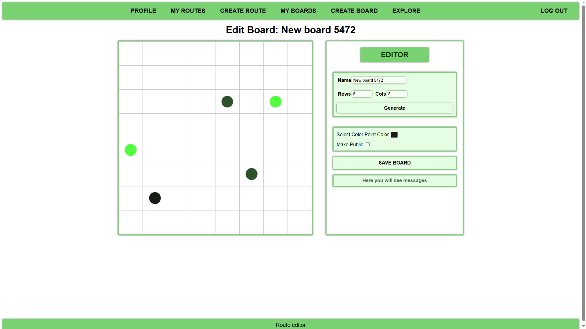
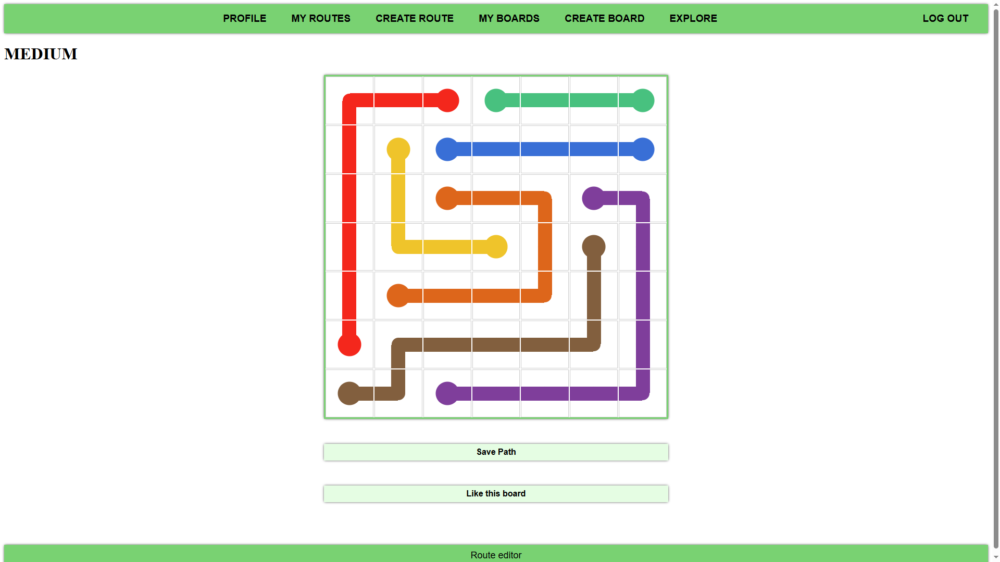

# Window for Creating and Editing a New Gameboard  
## The name, size, and colors can be changed in any appropriate way. Data validation is in place (e.g., the number of rows and columns cannot exceed 20). Making the Gameboard public means it can no longer be edited and can only be played — it will appear in the **EXPLORE** tab.  

# Window for Playing Gameboards  
## By clicking and dragging the mouse from one point to another, the user can draw a path to connect the points. Clicking a point that already has a path will remove it, allowing the user to create a new one. Users can like a Gameboard, and in the **EXPLORE** tab, there is a like counter. Gameboards can be sorted by the number of likes.  
